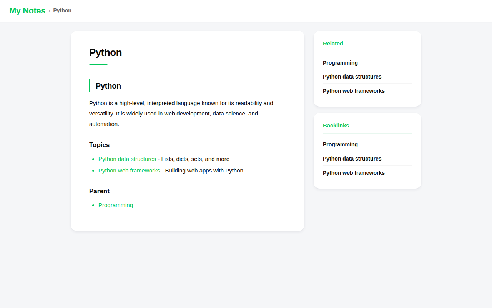

# obsidian-site-template

An example site for [obsidian-site](https://github.com/benelog/obsidian-site).

> **Want to create your own site?** Click the **"Use this template"** button at the top of this repository to get started.

## Demo

This template is deployed at https://benelog.github.io/obsidian-site-template/

## Structure

- `content/` — Markdown files from an Obsidian vault
- `site.yaml` — Site configuration (title, language, directories, etc.)
- `.github/workflows/deploy.yml` — GitHub Pages deployment workflow

## How to use

1. Click **"Use this template"** to create a new repository based on this template.
2. Replace the markdown files in `content/` with your own notes.
3. Edit `site.yaml` to set your site title and other options.
4. Enable GitHub Pages in your repository settings — the site will be built and deployed automatically on every push to `main`.

## Deployment

The GitHub Actions workflow uses [benelog/obsidian-site@v1](https://github.com/benelog/obsidian-site) to build the site and deploy it to GitHub Pages.

The workflow uses two GitHub-provided actions for deployment:

- **[`actions/upload-pages-artifact`](https://github.com/actions/upload-pages-artifact)** — Packages the build output (`./public`) as a GitHub Pages artifact and uploads it.
- **[`actions/deploy-pages`](https://github.com/actions/deploy-pages)** — Takes the uploaded artifact and deploys it to GitHub Pages. This action requires the repository's **Settings → Pages → Build and deployment → Source** to be set to **GitHub Actions**.

